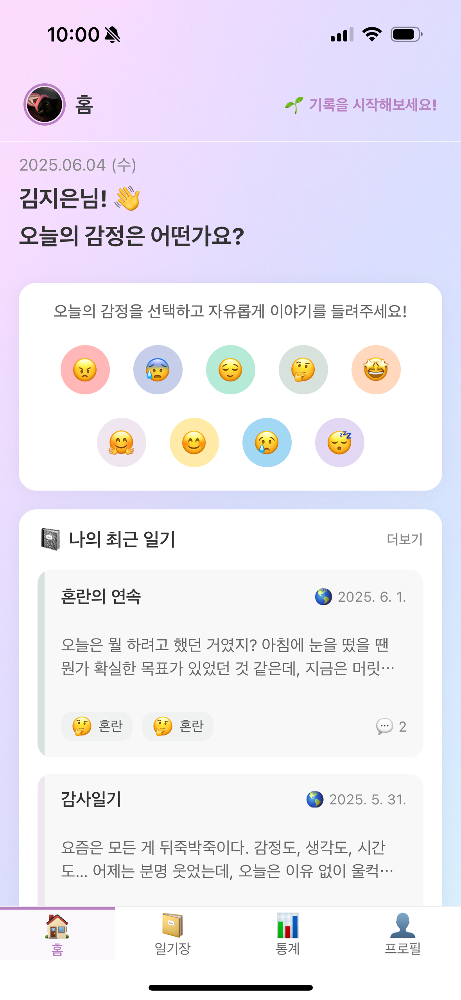
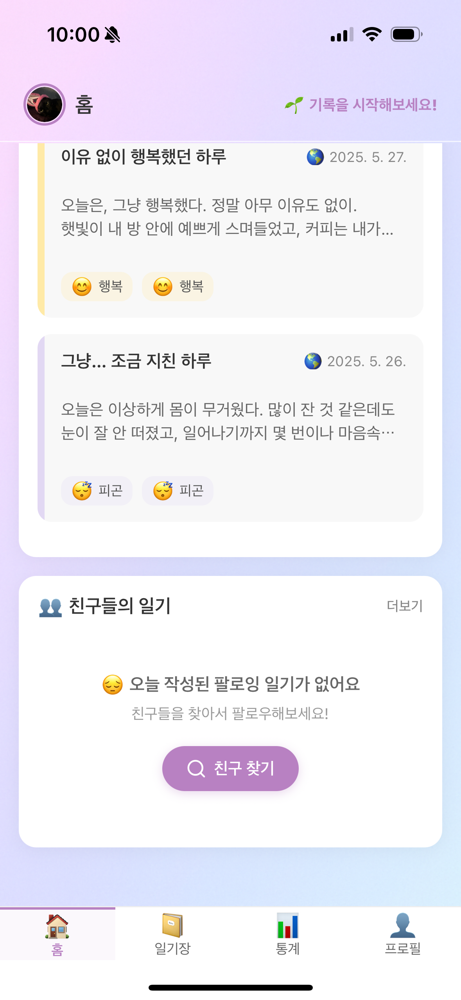
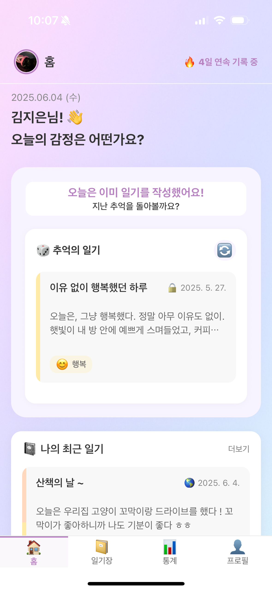
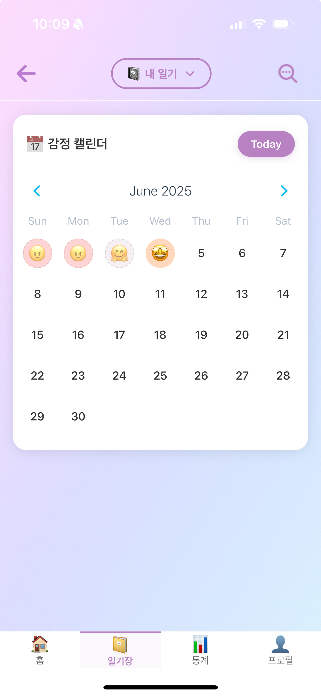
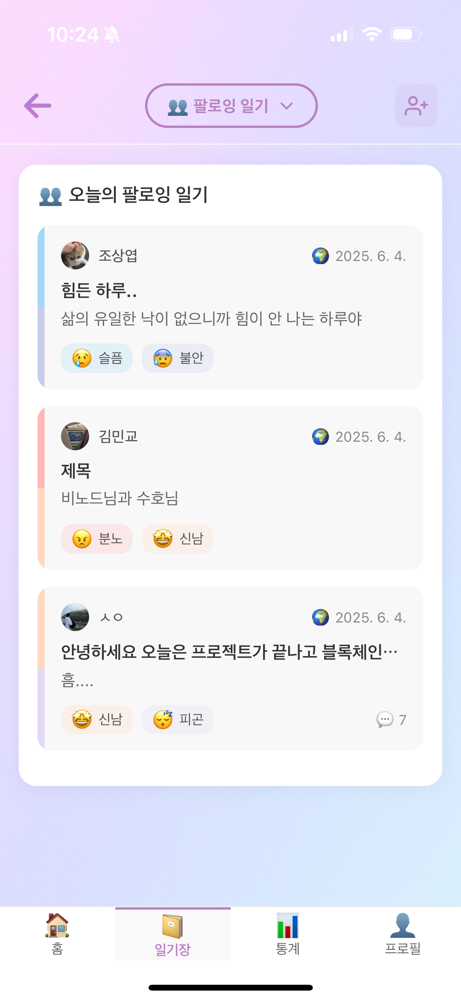
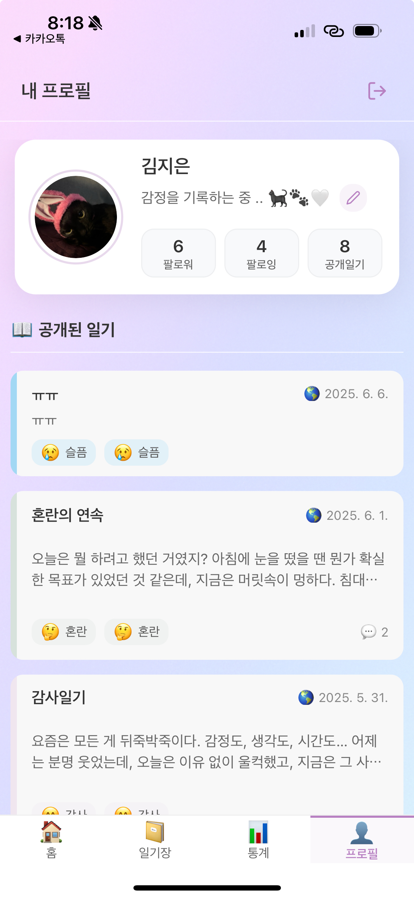
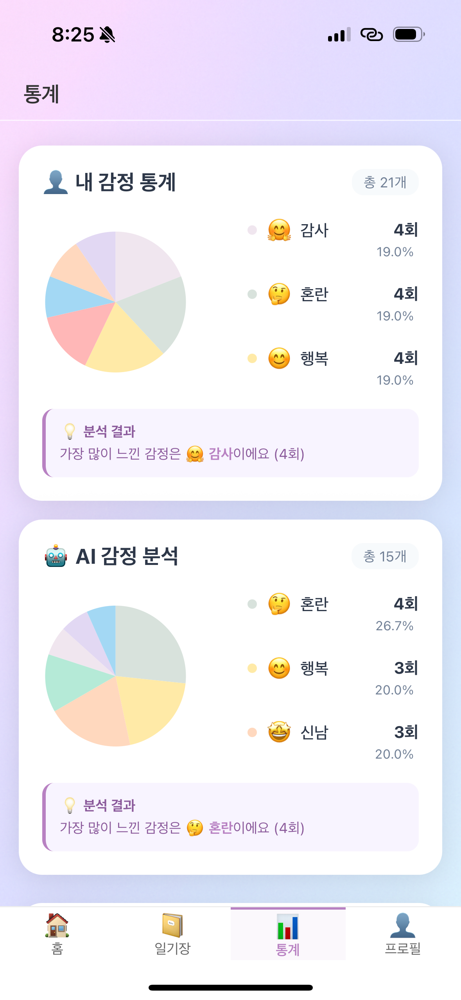
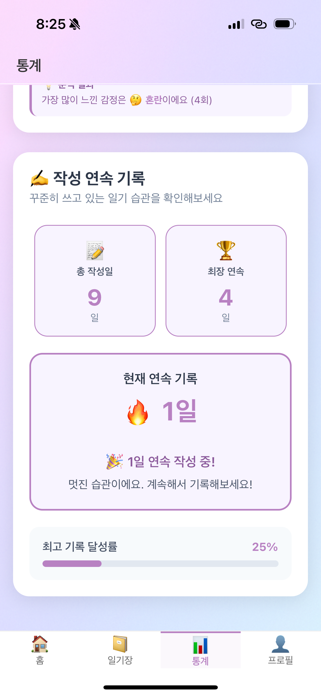

# ☁️ MoodCloud - 감정 기록 및 공유 앱
---

<p align="center">
  
</p>
<h1 align="center">MoodCloud</h1>
<p align="center">
"MoodCloud는 '감정을 담는 구름'이라는 의미로, AI 분석과 스트릭 시스템을 활용해 감정 표현이 어려운 현대인의 정서적 웰빙과 지속가능한 기록 습관을 지원하는 플랫폼입니다."
</p>

---

## 📖 목차
- [✨ 프로젝트 소개](#-프로젝트-소개)
- [📝 프로젝트 개요](#-프로젝트-개요)
- [🚀 배포 정보](#-배포-정보)
- [💡 주요 기능](#-주요-기능)
- [🧑‍💻 팀원 및 주요 기여](#-팀원-및-주요-기여)
- [📱 화면 구성 및 기능](#-화면-구성-및-기능)
  - [🎬 Welcome Page](#-welcome-page)
  - [🏠 메인 화면 (홈)](#-메인-화면-홈)
  - [📔 일기 관련 화면](#-일기-관련-화면)
  - [👥 소셜 기능](#-소셜-기능)
  - [👤 사용자 프로필 화면](#-사용자-프로필-화면)
  - [📊 통계 화면](#-통계-화면)
- [🔧 API 주요 명세](#-api-주요-명세)
- [🛠 기술 스택 및 협업 도구](#-기술-스택-및-협업-도구)
- [📁 프로젝트 폴더 구조](#-프로젝트-폴더-구조)
- [💭 프로젝트 회고 (4L)](#-프로젝트-회고-4l)

---
## ✨ 프로젝트 소개

MoodCloud는 바쁜 일상 속에서 자신의 감정을 돌아보고 기록할 수 있는 공간을 제공합니다. 사용자는 다양한 감정 아이콘을 선택하여 그날의 기분을 표현하고, 상세한 일기를 작성할 수 있습니다. AI 감정 분석을 통해 스스로도 미처 깨닫지 못했던 내면의 감정까지 발견하고, 연속 기록 스트릭과 월별 감정 통계로 자신만의 감정 패턴을 이해할 수 있습니다. 친구들과의 일기 공유 기능을 통해 혼자가 아닌 연결된 정서 경험을 나누며, 꾸준히 자신의 마음을 돌보고 타인과 긍정적인 관계를 맺도록 돕는 것을 목표로 합니다.

---

## 💬 프로젝트 개요
- **프로젝트명**: MoodCloud
- **목적**: 사용자의 감정 기록, 일기 작성 및 소셜 공유를 위한 플렛폼 개발
- **개발 기간**: 2025.05.13 ~ 2025.06.01 
- **참여 인원**: 총 3명

---

## 🚀 배포 정보

### 테스트 환경

#### 📱 모바일 앱 (Expo)
- **Expo Go 앱 다운로드**
  - [iOS App Store](https://apps.apple.com/app/expo-go/id982107779)
  - [Android Play Store](https://play.google.com/store/apps/details?id=host.exp.exponent)

- **앱 실행 방법**
  1. Expo Go 앱 설치
  2. 아래 QR 코드를 스캔하거나 링크로 접속:
     - [Expo Go 링크](https://expo.dev/preview/update?message=Version%201.0.3&updateRuntimeVersion=1.0.2&createdAt=2025-06-05T06%3A22%3A37.957Z&slug=exp&projectId=7cdbd4d8-a4ea-4f4b-b914-d29b6312b483&group=3c41cc86-4eeb-4060-a215-ac30d4761568)

     

  3. 또는 프로젝트 루트 디렉토리에서:
     ```bash
     npm install
     npx expo start
     ```


#### 🌐 웹 버전
- **배포된 웹사이트**: [https://cuekim.shop/](https://cuekim.shop/)

### 스토어 배포
- **App Store**: 예정
- **Google Play**: 예정

---

## 💡 주요 기능
* 오늘의 감정 선택 및 기록 (감정 아이콘 활용)
* Open AI의 API를 활용한 일기 감정 분석
* 상세 일기 작성, 수정, 삭제 기능 
* 상세 일기 댓글 기능
* 일기 및 감정 기록 기반 연속 스트릭 표시
* 감정 통계 시각화 (파이차트, 막대그래프 등)
* 친구 팔로우/팔로잉 및 친구 일기 피드
* 사용자 프로필 (자기소개, 프로필 이미지, 공개 일기 목록)
* 일기 공개/비공개 설정
* 친구 검색 기능


---

## 🧑‍💻 팀원 및 주요 기여

| 이름   | 깃허브                               | 주요 기여                                                                                                                                                                                                                            |
| :----- | :----------------------------------- | :----------------------------------------------------------------------------------------------------------------------------------------------------------------------------------------------------------------------------------- |
| 김지은 | [@zzeen2](https://github.com/zzeen2) | **📱 모바일 앱 프론트엔드 리드**<br>• React Native 기반 UI/UX 설계 및 전체 화면 구현<br>• 상태 관리 (Redux/Context API) 구조 설계 및 적용<br>• 내비게이션 및 공통 컴포넌트 개발<br>• API 연동 및 클라이언트 데이터 처리 로직 구현<br><br>**🌐 웹 프론트엔드 기여**<br>• 초기 EJS 템플릿 기반 웹 구조 설계<br><br>**🔧 백엔드 API 보완**<br>• 기존 API의 누락된 기능 추가 및 수정<br>• 사용자 카카오 인증, 일기 CRUD, 감정 분석 API 보완<br><br>**🛠 프로젝트 관리**<br>• MoodCloud 프로젝트 아이디어 제안 및 기획<br>• 프로젝트 초기 아키텍처 설계<br>• 팀 전체 개발 방향 리드 및 일정 관리 |

---

## 📱 화면 구성 및 기능

### 🎬 Welcome Page
<div align="center">
  
  <br><b>웰컴 페이지 플로우</b>
</div>

**주요 기능**:
- **카카오 OAuth 인증**: WebView 기반 카카오 로그인 구현
- **자동 로그인**: AsyncStorage를 통한 로그인 상태 유지

### 🏠 메인 화면 (홈)
<div align="center">
  <table>
    <tr>
      <td align="center">
        <br/>
        <b>메인 화면 - 구성 1</b>
      </td>
      <td align="center">
        <br/>
        <b>메인 화면 - 구성 2</b>
      </td>
    </tr>
  </table>
</div>

<div align="center">
  <table>
    <tr>
      <td align="center">
        <br/>
        <b>메인 화면 - 감정만 저장</b>
      </td>
      <td align="center">
        <br/>
        <b>메인 화면 - 감정/일기 직성 후</b>
      </td>
    </tr>
  </table>
</div>

**주요 기능**:
- **오늘의 감정 선택**: 8가지 감정 아이콘 (기쁨, 슬픔, 화남, 평온, 사랑, 놀람, 불안, 지루함)
- **감정 기록 후 화면**: 감정/일기 등록 후 랜덤 일기 추천으로 재미 요소 제공
- **감정만 기록**: 간단한 감정 기록으로 빠른 오늘 감정 기록 가능
- **연속 스트릭**: 상단 헤더에 연속 기록 일수 표시로 동기부여
- **일기 요약 섹션**: 본문 스크롤 영역에 내 일기/팔로워 일기 요약 표시

### 📔 일기 관련 화면

#### ✍️ 일기 작성
<div align="center">
  
  <br><b>감정 일기 작성 플로우</b>
</div>

**주요 기능**:
- **감정 아이콘 표시**: 선택한 감정이 상단 감정 섹션에 표시
- **공개/비공개 설정**: 일기 공개 범위 선택
- **AI 감정 분석**: 작성 완료 시 OpenAI API를 통한 감정 분석

#### 📅 일기 목록 (일기 검색)
<div align="center">
  <table>
    <tr>
      <td align="center">
        
        <br/><b>일기 저장 후 내 일기 달력</b>
      </td>
      <td align="center">
        
        <br><b>내 일기 검색 플로우</b>
      </td>
    </tr>
  </table>
</div>

**주요 기능**:
- **달력 뷰**: 월별 달력에서 일기 및 감정 작성 여부 시각적 표시
- **감정 아이콘 표시** : 감정만 등록 혹은 기존 일기 삭제 시 아이콘 백그라운드 반투명 및 테두리 점선 처리
- **일기 검색**: 특정 날짜 클릭 시 해당 날짜 일기 조회
- **감정별 필터링**: 감정 아이콘으로 일기 분류
- **일기 요약**: 카드 형태로 일기 제목, 감정, 작성 시간 표시

#### 📝 일기 상세 및 댓글
<div align="center">
  
  <br><b>일기 수정 및 댓글 기능</b>
</div>

**주요 기능**:
- **일기 상세 보기**: 전체 일기 내용, 작성자, 날짜, 감정 표시
- **수정/삭제**: 본인 일기일 경우 수정 및 삭제 기능
- **댓글 시스템**: 팔로워와 일기에 대한 댓글 작성
- **공개 설정 변경**: 비공개/공개 전환 가능

### 👥 소셜 기능

#### 📖 친구 일기 목록
<div align="center">
  
  <br/><b>친구 일기 목록탭</b>
</div>

**주요 기능**:
- **팔로잉 일기 피드**: 팔로우한 친구들의 오늘 작성된 공개 일기 목록
- **팔로잉 추가**: 헤더 오른쪽의 팔로잉 버튼을 눌러 팔로잉 검색 및 추가 가능

#### 👤 친구 추가/팔로우
<div align="center">
  
  <br/><b>친구 프로필 및 팔로우 기능</b>
</div>

**주요 기능**:
- **친구 검색**: 닉네임으로 친구 검색(카카오 닉네임)
- **프로필 조회**: 친구의 프로필 정보 및 공개 일기 목록
- **팔로우/언팔로우**: 팔로우/팔로잉 버튼으로 상호작용

#### 👥 팔로워/팔로잉 관리
<div align="center">
  
  <br/><b>팔로워/팔로잉 목록 모달</b>
</div>

**주요 기능**:
- **팔로워 목록**: 나를 팔로우하는 사용자 목록
- **팔로잉 목록**: 내가 팔로우하는 사용자 목록
- **프로필 이동**: 목록에서 친구 프로필로 바로 이동

### 👤 사용자 프로필 화면
<div align="center">
  
  <br/><b>내 프로필 화면</b>
</div>

**주요 기능**:
- **프로필 정보**: 프로필 이미지, 닉네임, 자기소개 표시 및 수정
- **통계 정보**: 팔로워/팔로잉 수, 공개 일기 수 등
- **내 일기 목록**: 작성한 공개 일기들의 목록

### 📊 통계 화면
<div align="center">
  <table>
    <tr>
      <td align="center">
        <br/>
        <b>감정 통계 (원그래프)</b>
      </td>
      <td align="center">
        <br/>
        <b>연속 기록 스트릭</b>
      </td>
    </tr>
  </table>
</div>

**주요 기능**:
- **감정 분포 차트**: 누적 감정 통계 원그래프
- **연속 기록 스트릭**: 누적 기록을 확인 가능한 연속 기록 통계 시스템
- **목표 설정**: 월별 기록 목표 설정 및 달성률 표시

---

## 🔧 API 주요 명세

### 사용자 인증 API
| Method | Path | Description | 앱에서의 활용 |
|--------|------|-------------|---------------|
| POST | `/login/kakaoapp` | 카카오 앱 로그인 | WebView 기반 OAuth 구현 |
| GET | `/login/app/user` | 내 프로필 정보 조회 | 로그인 후 사용자 정보 표시 |
| GET | `/login/search/users` | 사용자 검색 | 친구 검색 기능 |

### 메인 화면 API
| Method | Path | Description | 앱에서의 활용 |
|--------|------|-------------|---------------|
| GET | `/main/app/checkTodayWritten` | 오늘 일기 작성 여부 확인 | 메인 화면 분기 처리 |
| GET | `/main/app/todayDiary` | 오늘 작성한 일기 조회 | 메인 화면 일기 표시 |
| GET | `/main/app/randomDiary` | 랜덤 일기 조회 | 메인 화면 재미 요소 |
| GET | `/main/app/mydiary` | 내 최근 일기 목록 | 메인 화면 하단 일기 목록 |
| GET | `/main/app/diary/followed` | 팔로잉 일기 목록 | 메인 화면 친구 일기 피드 |
| POST | `/main/app/emotionOnly` | 감정만 기록 | 빠른 감정 기록 기능 |
| GET | `/main/app/streak` | 연속 기록 스트릭 | 상단 헤더 스트릭 표시 |
| GET | `/main/app/written-dates` | 작성한 날짜 목록 | 달력 뷰 데이터 |

### 일기 작성 API
| Method | Path | Description | 앱에서의 활용 |
|--------|------|-------------|---------------|
| POST | `/write/app` | 일기 작성 | 일기 작성 화면 |
| POST | `/write/analyze` | AI 감정 분석 | 일기 작성 후 감정 분석 |
| POST | `/write/upload` | 이미지 업로드 | 일기 작성 시 이미지 첨부 |

### 일기 관리 API
| Method | Path | Description | 앱에서의 활용 |
|--------|------|-------------|---------------|
| GET | `/detail/:id` | 일기 상세 조회 | 일기 상세 화면 |
| PUT | `/edit/app/:id` | 일기 수정 | 일기 수정 화면 |
| DELETE | `/detail/delete/:id` | 일기 삭제 | 일기 상세 화면 |
| POST | `/detail/app/createComment` | 댓글 작성 | 일기 상세 화면 댓글 |

### 친구/팔로우 API
| Method | Path | Description | 앱에서의 활용 |
|--------|------|-------------|---------------|
| POST | `/follow/create` | 팔로우 생성 | 친구 프로필 팔로우 |
| DELETE | `/follow/delete` | 팔로우 삭제 | 친구 프로필 언팔로우 |
| GET | `/follow/status` | 팔로우 상태 확인 | 친구 프로필 팔로우 버튼 |
| GET | `/follow/app/followers` | 팔로워 목록 | 프로필 팔로워 모달 |
| GET | `/follow/app/followings` | 팔로잉 목록 | 프로필 팔로잉 모달 |
| GET | `/follow/app/followings/todayDiaries` | 팔로잉 오늘 일기 | 친구 일기 탭 |

### 프로필 API
| Method | Path | Description | 앱에서의 활용 |
|--------|------|-------------|---------------|
| GET | `/mypage/public/:uid` | 공개 일기 목록 | 사용자 프로필 화면 |
| GET | `/mypage/app/userBio` | 사용자 정보 수정 | 프로필 자기소개 수정 |

### 통계 API
| Method | Path | Description | 앱에서의 활용 |
|--------|------|-------------|---------------|
| GET | `/stats/app/emotion` | 감정 통계 | 통계 화면 원그래프 |
| GET | `/stats/app/streak` | 스트릭 통계 | 통계 화면 스트릭 |

### 기타 API
| Method | Path | Description | 앱에서의 활용 |
|--------|------|-------------|---------------|
| GET | `/main/emotionAll` | 모든 감정 조회 | 감정 선택 화면 |
| GET | `/main/app/calendar-emotions` | 달력 감정 데이터 | 달력 뷰 감정 표시 |

---
## 🛠 기술 스택 및 협업 도구
- **Frontend**:
  
  
  
  
  <!-- (Redux, Zustand 등) 추가 -->
  
  

- **Backend**:
  
  

- **Database**:
  

- **Version Control**:
  
  

- **Collaboration Tools**:
  <!-- 사용하신 협업 도구 명시 -->
  
  

---

## 📁 프로젝트 폴더 구조
```
📦MoodCloudApp
┣ 📂src
┃ ┣ 📂actions // Redux 액션 및 비동기 요청 함수
┃ ┣ 📂api // API 호출 함수 모듈
┃ ┣ 📂assets // 이미지, 폰트 등 정적 에셋
┃ ┃ ┗ 📂readme_imgs // README용 이미지 및 비디오
┃ ┣ 📂components // 재사용 가능한 UI 컴포넌트 (Atomic Design)
┃ ┃ ┣ 📂atoms // 기본 UI 요소 (버튼, 텍스트, 아이콘 등)
┃ ┃ ┃ ┣ 📂buttons // 버튼 컴포넌트
┃ ┃ ┃ ┣ 📂icons // 아이콘 컴포넌트
┃ ┃ ┃ ┣ 📂inputs // 입력 컴포넌트
┃ ┃ ┃ ┣ 📂TextsAndLabel // 텍스트 및 라벨 컴포넌트
┃ ┃ ┃ ┗ 📂thumbnail // 썸네일 컴포넌트
┃ ┃ ┣ 📂molecules // 분자 단위 컴포넌트
┃ ┃ ┃ ┣ 📂boxes // 박스 컴포넌트
┃ ┃ ┃ ┣ 📂cards // 카드 컴포넌트
┃ ┃ ┃ ┣ 📂filters // 필터 컴포넌트
┃ ┃ ┃ ┣ 📂headers // 헤더 컴포넌트
┃ ┃ ┃ ┣ 📂modals // 모달 컴포넌트
┃ ┃ ┃ ┗ 📂Rows // 행 컴포넌트
┃ ┃ ┣ 📂organisms // 유기체 단위 컴포넌트
┃ ┃ ┃ ┣ 📂Detail // 상세 화면 관련 컴포넌트
┃ ┃ ┃ ┣ 📂main // 메인 화면 관련 컴포넌트
┃ ┃ ┃ ┣ 📂stats // 통계 화면 관련 컴포넌트
┃ ┃ ┃ ┣ 📂TabBar // 탭바 컴포넌트
┃ ┃ ┃ ┗ 📂write // 작성 화면 관련 컴포넌트
┃ ┃ ┗ 📂templates // 화면 단위 템플릿 (Screen 컴포넌트)
┃ ┃   ┣ 📜createDiary.js // 일기 작성 화면
┃ ┃   ┣ 📜DiaryDetail.js // 일기 상세 화면
┃ ┃   ┣ 📜DiaryEdit.js // 일기 수정 화면
┃ ┃   ┣ 📜DiaryList.js // 일기 목록 화면
┃ ┃   ┣ 📜LoginScreen.js // 로그인 화면
┃ ┃   ┣ 📜MainScreen.js // 메인 화면
┃ ┃   ┣ 📜Myprofile.js // 내 프로필 화면
┃ ┃   ┣ 📜StatsTemplate.js // 통계 화면
┃ ┃   ┗ 📜UserProfile.js // 사용자 프로필 화면
┃ ┣ 📂context // React Context API
┃ ┣ 📂hooks // 커스텀 훅
┃ ┣ 📂reducers // Redux 리듀서
┃ ┣ 📂screens // 화면 컴포넌트
┃ ┃ ┗ 📜WelcomeScreens.js // 웰컴 화면
┃ ┣ 📂store // Redux 스토어 설정
┃ ┗ 📂utils // 유틸리티 함수
┣ 📜App.tsx // 앱 진입점
┣ 📜app.config.js // Expo 앱 설정
┣ 📜babel.config.js // Babel 설정
┣ 📜index.js // 앱 시작점
┣ 📜package.json // 프로젝트 의존성
┣ 📜tsconfig.json // TypeScript 설정
┗ 📜README.md // 프로젝트 문서
```

## 💭 프로젝트 회고 (4L)

### 👍 좋았던 점 (Liked)

#### 🤝 아이디어 고도화와 협업
주제 선정 과정에서 팀원 간 의견 충돌 없이 빠르게 합의가 이루어졌고, 구체화 과정에서도 각자의 아이디어가 자연스럽게 융합되어 방향 설정이 매끄럽게 진행되었습니다. 

#### 🎨 서비스 컨셉
단순한 일기 작성 플랫폼을 넘어, 사용자의 감정을 기록하고 이를 '구름'이라는 시각적 요소에 담아 표현하는 컨셉이 팀 전체에게 매력적으로 다가왔습니다. 듀오링고의 스트릭 시스템에서 착안한 '연속 기록 유도 시스템'은 테스트 사용자로부터 실질적인 동기부여 요소로 작용했다는 긍정적인 피드백을 받았습니다.

#### 🛠️ 기술 스택 선택
프론트엔드는 React Native, 백엔드는 Node.js/Express 기반으로 구성하여 앱과 웹을 모두 대응할 수 있는 구조로 설계했고, Expo를 활용하여 빠른 개발 및 테스트 환경을 구축할 수 있었던 점도 개발 효율성을 높이는 데 도움이 되었습니다.

### 📚 새롭게 배운 점 (Learned)

#### 📱 모바일 앱 개발 전체 흐름 이해
React Native 기반의 모바일 앱 개발이 처음이었음에도, Expo의 구조, 빌드 시스템, 그리고 Native 모듈 적용 방식을 직접 경험하며 모바일 앱 개발의 전반적인 흐름을 익힐 수 있었습니다. 특히 iOS와 Android 플랫폼 간의 차이점, 네이티브 모듈 연동 등 웹 개발에서는 고려하지 않았던 요소들을 경험했습니다.

#### 🗂️ 효율적인 상태 관리 및 폴더 구조 설계
Redux를 활용해 상태 관리를 분리하고, streak, user, emotion 등의 핵심 상태를 효율적으로 관리했습니다. 이 과정에서 이전 프로젝트에서 혼동을 겪었던 재사용 가능한 폴더 구조 설계 및 적용 방법을 체득할 수 있었습니다. 컴포넌트 재사용성과 유지보수성을 고려한 구조 설계의 중요성을 깊이 이해하게 되었습니다.

#### 🎨 UI/UX 심화 학습
프론트엔드에서 감정 선택, 일기 작성, 통계 시각화 등 UI 흐름을 사용자 관점에서 설계하기 위해 노력하며, UI/UX에 대한 이해를 한층 더 구체적으로 발전시키는 계기가 되었습니다. 특히 감정을 시각적으로 표현하는 방법과 사용자 인터랙션 설계에 대한 경험을 쌓을 수 있었습니다.

#### 🔐 소셜 로그인(OAuth) 구현과 환경 의존성 극복
모바일 앱 개발 과정에서 예상치 못한 난관에 부딪히기도 했습니다. 특히 카카오 로그인 기능 구현은 저의 문제 해결 능력을 키울 수 있는 큰 학습 경험이었습니다:

1. **1차 시도 - expo-auth-session**: Expo Go 개발 환경의 exp:// 스킴과 카카오의 HTTPS redirect_uri 요구사항 불일치로 작동하지 않음
2. **2차 시도 - @react-native-seoul/kakao-login**: 네이티브 모듈을 시도했으나, 앱 빌드 과정에서 Maven 저장소나 Kotlin 버전 호환성 등 네이티브 의존성 관리의 복잡성으로 어려움 겪음
3. **최종 해결책 - WebView 방식**: 앱 내에서 카카오 로그인 페이지를 직접 제어하고 onNavigationStateChange로 리다이렉트 URL을 파싱함으로써, 개발 환경의 제약을 우회하고 성공적으로 기능 구현

이러한 시행착오를 통해 OAuth 인증 흐름과 redirect_uri 처리 메커니즘, 그리고 Expo 환경에서의 네이티브 기능 연동에 대한 깊이 있는 이해를 얻게 되었습니다.

#### 🌐 웹 개발과 앱 개발의 차이점 이해
기존 웹 개발 경험만 있었던 상태에서 앱 개발을 시작하면서, 두 환경의 근본적인 차이점을 깊이 이해할 수 있었습니다. Expo의 개발 환경과 실제 빌드 환경의 차이, 네이티브 코드와의 상호작용 등 앱 개발만의 특수한 고려사항들을 공부했습니다. 이를 통해 크로스 플랫폼 개발의 장단점과 한계점을 직접 체감하며, 더 나은 개발 결정을 내릴 수 있는 통찰력을 얻었습니다.

### 🧩 부족했던 점 (Lacked)

#### 📋 API 설계와 협업 프로세스 미흡
프론트와 백엔드를 분리하여 작업하고자 했으나, 앱 프론트와 백엔드 간 API 명세에 대한 사전 협의가 부족해, 앱 프론트에서 일부 기능 구현 시 API를 추가하거나 수정하는 경우가 발생했습니다. 이로 인해 개발 중반에 불필요한 수정 작업이 반복되었다. 또한 API 설계에 있어 RESTful하지 못했습니다.

#### 📊 데이터 시각화와 UX 최적화 부족
감정 데이터 시각화와 관련된 통계 페이지 구현에서, 사용자 데이터를 바탕으로 한 UX 최적화가 부족하여 개선 여지가 남았다. 단순한 차트 표시를 넘어 사용자에게 의미 있는 인사이트를 제공하는 방향으로 발전시키지 못했습니다.

#### 🔄 상태 관리 구조의 일관성 부족
로그인 후 유저 정보를 글로벌 상태로 관리하는 방식에서 Redux와 Context API가 혼용되어 구조적으로 일관성이 떨어지는 부분이 있었습니다. 이로 인해 상태 관리 로직이 복잡해지고 디버깅이 어려운 상황이 발생했습니다.

#### 🏗️ 초기 프로젝트 구조 설계 미흡
프로젝트 초기 구조 설계와 폴더 구조 정리에 더 많은 시간을 들였다면, 중후반 기능 확장 및 유지보수가 수월했을 것이라고 생각합니다. 보일러플레이트 코드의 중요성과 클린코드가 초반에는 부족해서 중복적으로 많이 사용하거나 정리되지 않은 코드들이 아쉬움을 느꼈고, 이후 이를 개선하기 위해 최대한 지키려 노력했습니다.

### 🌠 구현하고 싶었지만 구현하지 못한 점 (Longed for)

#### 📈 고도화된 데이터 시각화 기능
감정 변화 추이를 시각적으로 보여주는 선형 그래프나 히트맵 기반 통계 기능은 기획되었지만 시간 관계상 구현 범주에서 제외되었습니다. 사용자가 자신의 감정 패턴을 더 직관적으로 이해할 수 있는 고급 시각화 기능들을 추가하고 싶었습니다.

#### 🤖 AI 기반 맞춤형 콘텐츠 추천
사용자의 감정 상태에 따른 개인화된 경험 제공이 목표였기 떄문에 AI 감정 분석 결과를 바탕으로 한 맞춤형 콘텐츠 추천(예: 음악, 명언, 일기 예시 등)을 구현하고자 했으나, 외부 API 연동 및 추천 알고리즘 설계에 시간이 부족했습니다. 

#### 👥 소셜 기능 확장
친구 간 감정 공유 후 피드백이나 공감 버튼 등 커뮤니케이션 기능을 추가하려 했으나, 기본 기능 완성도 확보를 우선시하여 추후 기능으로 미뤄졌습니다. 감정 공유를 통한 사회적 연결감 형성이 서비스의 핵심 가치 중 하나였기에 추후에 업데이트에 반영 할 예정입니다.

#### 🔔 푸시 알림 시스템
감정 기록 리마인드 알림 기능(예: 매일 밤 10시 푸시 알림)도 사용자의 꾸준한 기록을 유도하기 위한 아이디어였지만, Expo Push Notification 세팅 문제로 구현이 보류되었습니다. 

#### 🌱 감정 캐릭터 성장 시스템
초기에는 게임화 요소를 통한 사용자 참여 동기 부여가 목적으로 감정 기록 기반으로 나만의 감정 캐릭터를 성장시키는 '감정 구름 성장 시스템'도 기획되었지만, 디자인 리소스 부족과 개발 범위 제한으로 도입하지 못했습니다. 

#### 📱 앱 스토어 배포
추후에 백엔드 및 프론트엔드 서버가 안정화된다면, 앱스토어나 플레이스토어에 배포를 해보는 것도 좋은 경험이 될 것 같습니다. 이를 통해 한정된 테스트 사용자가 아닌 실제 사용자들의 피드백을 받고, 앱 스토어 배포 프로세스와 앱 심사 과정에 대한 경험을 쌓을 수 있을 것이라고 생각합니다.

---

### 💭 총평 및 향후 계획

이번 프로젝트를 통해 기존의 웹 개발 프로젝트에서는 경험하지 못했던 앱 개발의 전 과정을 직접 경험할 수 있었습니다. 특히 OAuth 구현 과정에서 발생한 여러 이슈를 비롯해, 개발 환경 및 배포 환경 설정 등 기초 세팅 단계에서의 미숙함으로 인해 예상보다 많은 시간을 학습에 투자해야 했습니다. 실제 개발 시간보다 스터디에 더 많은 노력이 필요했지만, 그만큼 얻은 인사이트와 성장도 컸습니다. 이러한 문제 해결 과정을 거치며 기술적 대응 능력과 문제 인식·해결력이 한층 향상되었음을 체감할 수 있었습니다.

향후에는 초기 기획 단계부터 더욱 체계적으로 접근하여, RESTful API 명세 정의, 상태 관리 구조 설계, 코드 품질 유지 전략 등을 사전에 명확히 수립할 계획입니다. 또한 사용자 중심의 UX 설계 원칙과 데이터 기반의 의사결정의 중요성을 깊이 인식하고, 이를 다음 프로젝트에 적극적으로 반영하고자 합니다. 이번 경험을 바탕으로 기술 역량과 협업 역량을 동시에 강화하며 더 완성도 높은 결과물을 만들 수 있도록 노력할 것입니다.

